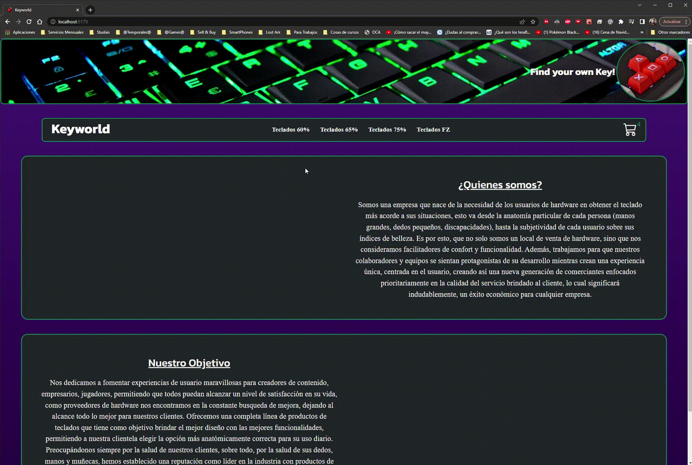

# Keyworld

Keyworld es el proyecto de empresa e-comerce que he trabajado para todos los cursos que he cursado en la academia de CoderHouse. Esto, a fin de buscar la homogeneidad entre las distintas técnicas desarrolladas para lograr el mismo fin, y también, para detectar con mayor detalle las pequeñas diferencias que brindan esas distintas técnicas, siempre con el propósito de conocer el procedimiento más adecuado para cada necesidad.

### Navegando por Keyworld

### Próximos pasos...

La incorporación exitosa de las imágenes desde el archivo ".json" y la mejora de diseño a fin de sincronizar mejor con los resultados anteriores.